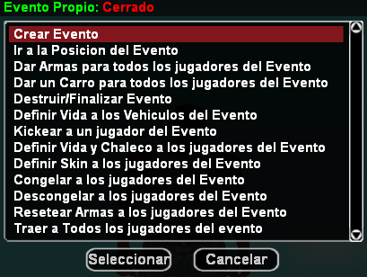

# _Event System - Sistema de Evento_

**Este sistema de Evento incluye funciones para crear, configurar y personalizar su Evento. Además de lugares especiales para crear su Evento.**

## _Lista de Comandos_

  `/cevento` - Crea tu propio Evento! (**Solo miembros RCON**)  
  `/usersev` - Lista de miembros en el Evento!  
  `/ejoin` - Ingresa al Evento creado!  
  `/salirevento` - Sales del Evento creado!   
  `/evsay` *[Mensaje]* - Anuncia a los del Evento creado! (**Solo miembros RCON**)  
  `/lugarese` - Lista de lugares para Eventos! (**Solo miembros RCON**)  

## Aclaración

**Puede modificar o ajustar cualquier parte del sistema si lo necesita. También puede corregir textos, mejorar las funciones o agregar detalles que crea útiles. Así podrá adaptarlo mejor a su proyecto o a la forma en que prefiera que funcione el sistema.**

## Creditos

- Desarrollador **(Straydet)** -> *(Desarrollo de algunas funciones/comandos)*
- [Idea y versión original](https://pastebin.com/ememJCKE) **(Marcelo_Play | marcelodell)**
